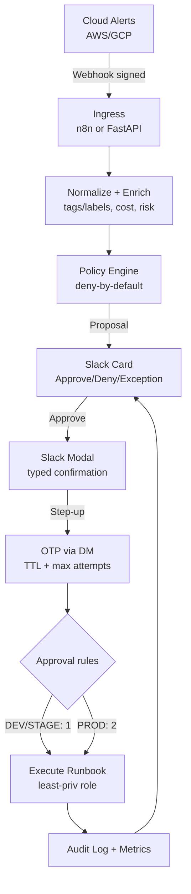

<div align="center">


# 🛡️ Cloud GuardDog (FinOps & SecOps)

**Policy-driven auto-remediation via Slack approvals — with OTP step-up & dual approval for PROD.**

[](https://github.com/welldefreitas/finops-guarddog/actions/workflows/ci.yml)
[](https://github.com/welldefreitas/finops-guarddog/actions/workflows/security.yml)
[](https://www.python.org/downloads/release/python-3110/)
[](https://fastapi.tiangolo.com/)
[](https://redis.io/)

> **Design stance:** *Policy-as-code* is the deterministic decision engine. The LLM is strictly optional and only explains/enriches context inside a rigid JSON schema. The AI never pulls the trigger.

</div>

---

## ⚡ What this repo provides (MVP skeleton)

* **FastAPI Core:**
  * Receives normalized alerts via signed webhooks.
  * Evaluates them against **deny-by-default** mathematical policies.
  * Issues an **Action Proposal** (What, Why, Risk Tier, ROI).
  * Manages **Rotating OTPs** (TTL + Max attempts limit).
  * Exposes Slack payload schemas ready for interactive modals.
* **Governance Scaffolding:**
  * `policies/rego/` — OPA-ready examples.
  * `runbooks/aws/` — Placeholders for safe, least-privilege action executors.
  * `slack/` — Block Kit templates & App manifests.
  * `docs/` — Architecture diagrams, Threat Models, and ADRs.

## 🔐 Built-in Security Controls
- 🛑 **Least privilege by design:** Executor roles are mapped per-runbook.
- 🔑 **Step-up confirmation:** Typed confirmation (`APPLY <ID>`) + Slack DM OTP (No static shared passwords).
- 👥 **Dual approval for PROD:** 2 distinct approvers required within a specific time window.
- 🔏 **Slack request verification:** Strict HMAC SHA256 signature validation.
- 📜 **Audit trail interface:** JSONL-friendly structured events ready for SIEM (Splunk/Datadog) ingestion.

---

## 🗺️ Architecture Workflow



---

## 🚀 Quickstart (Local Dev)

<details>
<summary><b>1. Create a virtualenv and install</b></summary>

```bash
python -m venv .venv
source .venv/bin/activate
pip install -U pip
pip install -e ".[dev]"
```
</details>

<details>
<summary><b>2. Run the API</b></summary>

```bash
uvicorn guardrails.app:app --reload --port 8000
```
</details>

<details>
<summary><b>3. Health check & Simulate Alert</b></summary>

```bash
# Check if API is alive
curl -s http://localhost:8000/healthz | jq

# Simulate an AWS FinOps Alert (Out-of-hours EC2)
curl -s http://localhost:8000/webhook/alert \
  -H "Content-Type: application/json" \
  -d '{
    "provider":"aws",
    "account_id":"111111111111",
    "env":"dev",
    "event_id":"evt-123",
    "resource": {"type":"ec2_instance","id":"i-0abc123","region":"us-east-1","tags":{"owner":"team-a"}},
    "finding": {"category":"finops","title":"EC2 left running out of hours","cost_per_day_usd": 50.0},
    "observed_at":"2026-02-26T08:00:00Z"
  }' | jq
```
</details>

---

## 🛡️ Threat Model (Quick View)

| Primary Threats | Baseline Mitigations |
| :--- | :--- |
| **Forged Webhooks / Injection** | Authenticity checks, rate-limiting, and deduplication. |
| **Slack Request Replay** | Signature verification + Timestamp tolerance (Anti-replay). |
| **Prompt-Injection (LLM)** | Closed action catalog + **deny-by-default** mathematical policies. |
| **Compromised Slack Session** | OTP step-up (TTL + limits) and **dual approval for PROD**. |
| **Blast Radius Expansion** | Per-runbook least-privilege IAM roles; no long-lived keys. |

> *Read the full security breakdown in `docs/threat-model.md`.*

---

## 🏗️ Production Readiness

### Redis Upgrade (Recommended)
This repo seamlessly supports Redis-backed state for Distributed OTP issuance, Proposal correlation, and PROD dual-approval coordination.

Set `REDIS_URL` in `.env` to enable. *(If unset, the app falls back to in-memory stores for local dev).*

```bash
cp .env.example .env
# edit .env (set APP_SECRET, Slack secrets/tokens)
docker compose up --build
```

### Hardened `/execute` Endpoint (Idempotency + HMAC)
The `/execute` endpoint is designed to be triggered by a **trusted runner** (e.g., n8n, Step Functions) and features bank-grade protections:
- **HMAC request signing** (shared secret) to prevent tampering.
- **Replay protection**: Timestamp tolerance + **nonce uniqueness**.
- **Idempotency keys**: Prevents duplicate infrastructure mutations if the network drops and retries.

<details>
<summary><b>View Python Signature Example</b></summary>

```python
import time, secrets, hmac, hashlib, json

secret = "YOUR_SHARED_SECRET"
ts = str(int(time.time()))
nonce = secrets.token_urlsafe(12)
body = json.dumps({"proposal_id":"abc"}).encode()

base = b"v1:" + ts.encode() + b":" + nonce.encode() + b":" + body
sig = "v1=" + hmac.new(secret.encode(), base, hashlib.sha256).hexdigest()
print(f"Timestamp: {ts} | Nonce: {nonce} | Sig: {sig}")
```
</details>

---

## ⚠️ Disclaimer
This project is an **Enterprise starter kit**. Do **not** deploy it to production accounts without proper IAM hardening, Vault/Secret Manager integration, and alignment with your internal change-management processes.


## 📜 License
MIT — see [LICENSE](LICENSE).

---

<p align="center">
  <b>Developed by Wellington de Freitas</b> | <i>Cloud Security & DevSecOps Architect</i>
  <br><br>
  <a href="https://linkedin.com/in/welldefreitas" target="_blank">
    
  </a>
  <a href="https://github.com/welldefreitas" target="_blank">
    
  </a>
  <a href="https://instagram.com/welldefreitas" target="_blank">
    
  </a>
</p>
